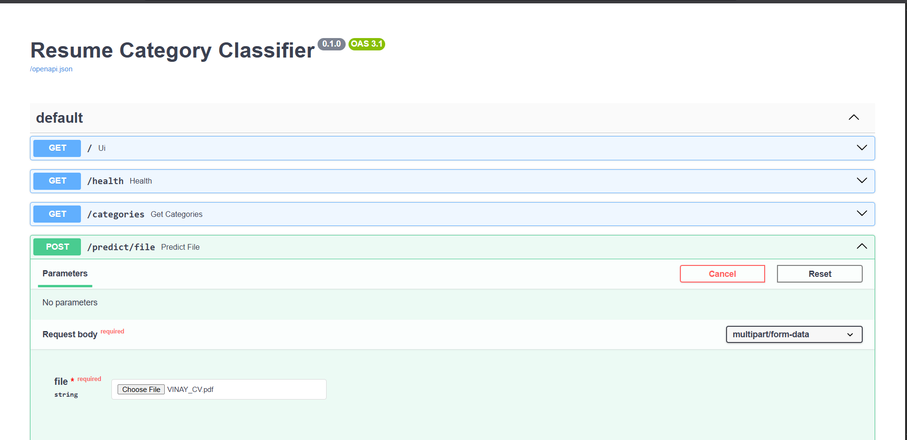
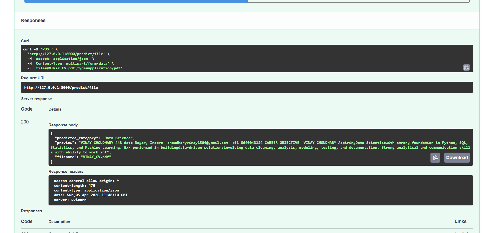
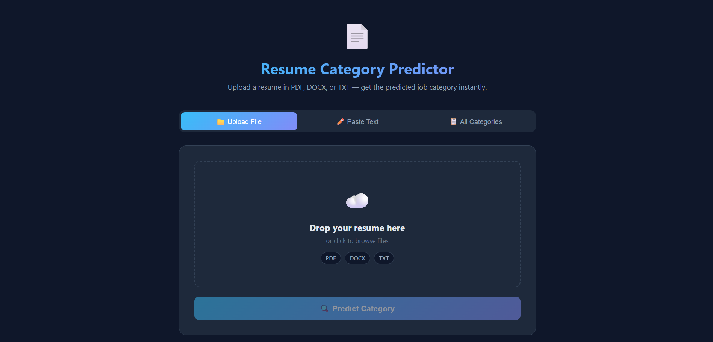
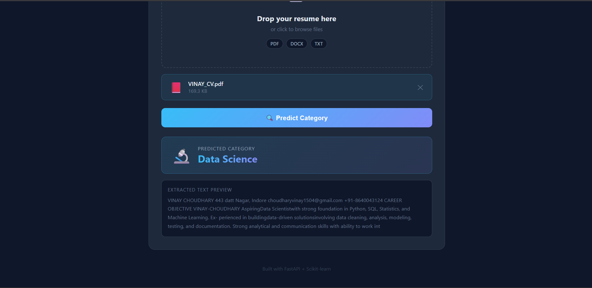
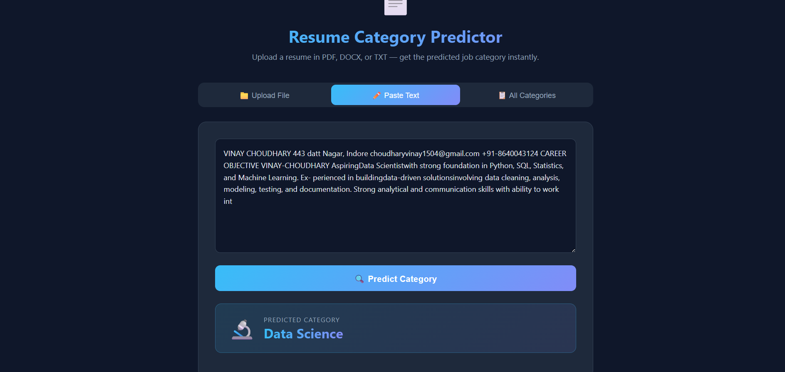
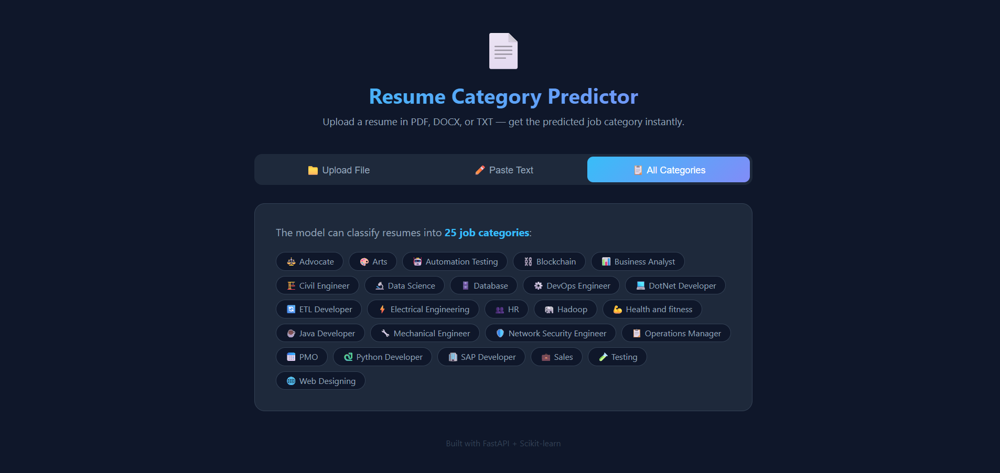

# Resume Screening System

🧾 Resume Screening System using SVM  

## 📋 Project Overview
Resume classification system using **TF-IDF + SVM**, deployed with **FastAPI + Web UI**.

---

## 🖥️ Step 1: API (Swagger UI)
API endpoints ko test karne ke liye Swagger UI use hota hai.  
Yaha se directly resume upload karke prediction check kar sakte ho.

---

## 📊 Step 2: API Response
API response me predicted category aur resume ka extracted preview text milta hai.

---

## 📤 Step 3: Upload Resume (UI)
User-friendly UI jaha user resume upload kar sakta hai drag & drop ya browse karke.  
- Supports **PDF, DOCX, TXT**

---

## 🔍 Step 4: Prediction Result
Predict button click karne ke baad model resume process karke category show karta hai.

- Predicted Category  
- Extracted Resume Text  

---

## ✍️ Step 5: Paste Text Option
User directly resume ka text paste karke bhi prediction le sakta hai.

---

## 📂 Step 6: All Categories
System jitni job categories support karta hai wo yaha display hoti hain.

---

## ⚙️ Tech Stack
- FastAPI  
- Scikit-learn (SVM)  
- TF-IDF  
- HTML, CSS  

---

## 🏁 Conclusion
Efficient resume screening using **NLP + SVM**, reducing manual effort and improving hiring workflow.
